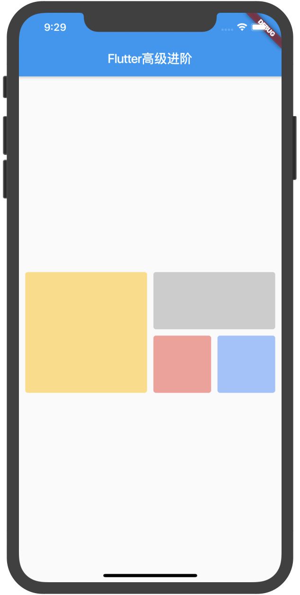
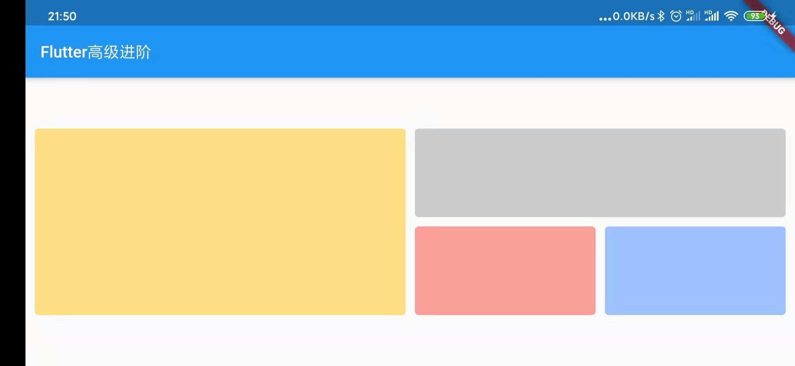

# 分析

Flutter可用适配组件：
Expanded、Flexible、Spacer、AspectRatio、Wrap、GridView、Table、SafeArea....

# 案例1

|  |  |
| :-----| ----: | 

##### 分析：

一行，两边外边距为10，两个区块宽高相等，右边区块一个列也是宽高相等，
右边的下区块又是一行，两边相等，所有间隔都为10。

##### 代码：
```dart
new Container( // 容器组件
  height: 200, // 设置默认高度
  margin: EdgeInsets.symmetric(horizontal: 10.0),// 两边的外边距
  child: new Row( // 一行显示
    children: <Widget>[
      // 第一个区块
      new Expanded(
        child: new Container(
          decoration: BoxDecoration(
              borderRadius: BorderRadius.all(Radius.circular(4.0)),// 圆角
              color: Colors.amber.withOpacity(0.5)),// 颜色
        ),
      ),
      // 间隔
      new SizedBox(width: 10.0, height: 10.0),
      // 第二个区块
      new Expanded(
        child: new Column(
          children: <Widget>[
            new Expanded( // 继续用Expanded撑开
              child: new Container(
                decoration: BoxDecoration(
                  borderRadius: BorderRadius.all(Radius.circular(4.0)),// 圆角
                  color: Colors.grey.withOpacity(0.5),// 颜色
                ),
              ),
            ),
            new SizedBox(width: 10.0, height: 10.0),// 间隔10
            new Expanded(
              child: new Row(
                children: <Widget>[
                  new Expanded(
                    child: new Container(
                      decoration: BoxDecoration(
                        borderRadius: BorderRadius.all(
                          Radius.circular(4.0),
                        ),
                        color: Colors.red.withOpacity(0.5),
                      ),
                    ),
                  ),
                  new SizedBox(width: 10.0, height: 10.0),
                  new Expanded(
                    child: new Container(
                      decoration: BoxDecoration(
                          borderRadius: BorderRadius.all(
                            Radius.circular(4.0),
                          ),
                          color: Colors.blueAccent.withOpacity(0.5)),
                    ),
                  ),
                ],
              ),
            )
          ],
        ),
      ),
      // 为了使代码简单就不减少嵌套了
    ],
  ),
)
```

这样就实现了Expanded自适应屏幕了，Expanded有个flex属性，
是负责控制占比空间的，不写则默认为1，值越大则占比越大。

# Expanded

##### 示例代码：
```dart
new Container(
  height: 100, // 设置默认高度
  margin: EdgeInsets.symmetric(horizontal: 10.0),
  child: new Row(
    children: <Widget>[
      // 第一个区块
      new Expanded(
        flex: 1,
        child: new Container(
          decoration: BoxDecoration(
              borderRadius: BorderRadius.all(Radius.circular(4.0)),
              color: Colors.amber.withOpacity(0.5)),
        ),
      ),
      // 间隔
      new SizedBox(width: 10.0, height: 10.0),
      // 第而个区块
      new Expanded(
        flex: 2,
        child: new Container(
          decoration: BoxDecoration(
            borderRadius: BorderRadius.all(
              Radius.circular(4.0),
            ),
            color: Colors.blueAccent.withOpacity(0.5),
          ),
        ),
      ),
      // 为了使代码简单就不减少嵌套了
    ],
  ),
);
```
第一个区块占比为1，第二个为2，则效果为：


# Spacer

Spacer同Expanded一样具有flex属性，其含义和使用也是一模一样，
一般用于Row（行）或 Column（列）组件。

##### 示例代码：
```dart
new Column(
  children: <Widget>[
    new Container(
      height: 200,
      decoration: BoxDecoration(
        borderRadius: BorderRadius.all(Radius.circular(4.0)),
        color: Colors.amber.withOpacity(0.5),
      ),
    ),
    new Spacer(flex: 1),
    new Container(
      height: 200,
      decoration: BoxDecoration(
        borderRadius: BorderRadius.all(Radius.circular(4.0)),
        color: Colors.blueAccent.withOpacity(0.5),
      ),
    ),
  ],
)
```

效果：


我们给最下面那个区块也加个Spacer试试：
```dart
new Column(
  children: <Widget>[
    ...
    new Container(
    ...
    ),
    new Spacer(flex: 1),
  ],
)
```
效果：


如果flex设置为2则会为第一个的两倍间隔。
