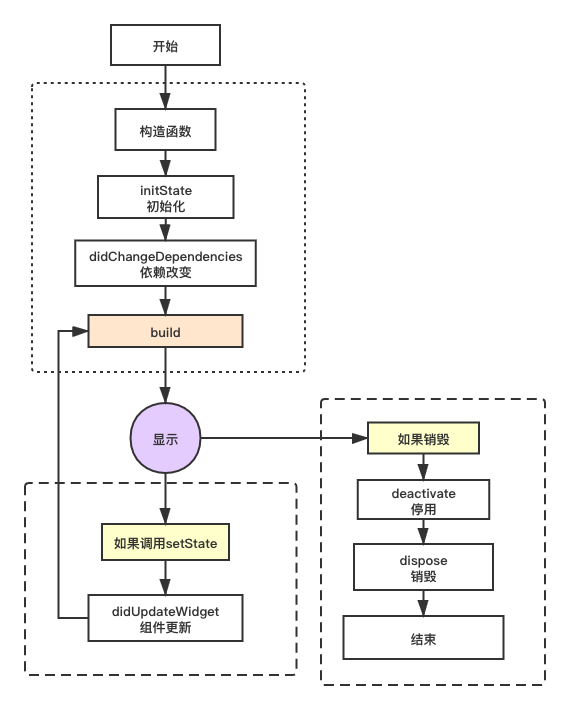

# 生命周期

Flutter生命周期相对于android的Activity，ta存在于`framework.dart`的State类，


# 实测
写个有状态类并混入WidgetsBindingObserver配合监听特殊状态及其一个按钮，调用setState，
给生命周期的方法新增打印：
```dart
import 'package:flutter/material.dart';

void main() => runApp(new MyApp());

class MyApp extends StatelessWidget {
  @override
  Widget build(BuildContext context) {
    return new MaterialApp(
      title: '生命周期',
      home: new LiftCycle(),
    );
  }
}

class LiftCycle extends StatefulWidget {
  @override
  _LiftCycleState createState() => _LiftCycleState();
}

class _LiftCycleState extends State<LiftCycle> with WidgetsBindingObserver {
  int count = 0;

  @override
  void initState() {
    super.initState();
    WidgetsBinding.instance.addObserver(this);
    print('初始化 initState');
  }

  @override
  void didUpdateWidget(LiftCycle oldWidget) {
    super.didUpdateWidget(oldWidget);
    print('组件更新 didUpdateWidget');
  }

  @override
  void reassemble() {
    super.reassemble();
    print('重新安装 reassemble');
  }

  @override
  void deactivate() {
    super.deactivate();
    print('停用  deactivate');
  }

  @override
  void dispose() {
    super.dispose();
    WidgetsBinding.instance.removeObserver(this);
    print('销毁 dispose');
  }

  @override
  void didChangeAppLifecycleState(AppLifecycleState state) {
    super.didChangeAppLifecycleState(state);
    print('特殊状态 state：$state');
  }

  @override
  void setState(fn) {
    super.setState(fn);
    print('状态刷新 setState');
  }

  @override
  Widget build(BuildContext context) {
    return new Scaffold(
      appBar: new AppBar(title: new Text('生命周期')),
      body: new Center(
        child: new FlatButton(
          onPressed: () => setState(() => count++),
          child: new Text('$count'),
        ),
      ),
    );
  }

  @override
  void didChangeDependencies() {
    super.didChangeDependencies();
    print('依赖改变 didChangeDependencies');
  }
}
```
然后我们现在来看看打印流程，正常打开App什么都不操作，就打印了：
```
I/flutter (15867): 初始化 initState
I/flutter (15867): 依赖改变 didChangeDependencies
I/flutter (15867): 重新安装 reassemble
I/flutter (15867): 组件更新 didUpdateWidget
```

热重载打印：
```
I/flutter (16141): 重新安装 reassemble
I/flutter (16141): 组件更新 didUpdateWidget
Reloaded 0 of 468 libraries in 186ms.
```
点击按钮打印：
```
I/flutter (16141): 状态刷新 setState
// count也+1了，说明重新调用过build。
```

# 流程图


图解主要部分：
* 1.构建`（build）`；
* 2.如果用户调用了`setState`时则状态刷新，重新build；
* 3.如果销毁先停用然后`dispose`销毁再结束；

# 特殊状态
我们自定义的State类混入了`WidgetsBindingObserver`，所以可以使用他的暂停和恢复，

初始化：
```dart
@override
void initState() {
 super.initState();
 WidgetsBinding.instance.addObserver(this); // 在这初始化了
 print('初始化 initState');
}
```
销毁：
```dart
@override
void dispose() {
  super.dispose();
  WidgetsBinding.instance.removeObserver(this); // 在这销毁
  print('销毁 dispose');
}
```

使用：
```dart
@override
void didChangeAppLifecycleState(AppLifecycleState state) {
  super.didChangeAppLifecycleState(state);
  print('特殊状态 state：$state');
}
```
这个`didChangeAppLifecycleState`是`WidgetsBindingObserver`类的一个方法，
可以用来判断当前的状态是在前台还是后台。

##### 这个方法接收一个`AppLifecycleState`类型的枚举：

|  枚举值   | 含义  |
|  ----  | ----  |
| resumed  | 程序可见，并响应用户输入。 |
| inactive  | 处于非活动状态，未收到用户输入。 |
| paused  | 程序当前不可见，不响应用户输入，并且在后台运行。 |
| suspending  | 程序将暂时暂停。 |

##### AppLifecycleState实测
当App返回到桌面或者其他不可见状态，但并未结束：
```
I/flutter ( 2428): 特殊状态 state：AppLifecycleState.inactive
I/flutter ( 2428): 特殊状态 state：AppLifecycleState.paused
```
当App回到可见状态：
```
I/flutter ( 2428): 特殊状态 state：AppLifecycleState.inactive
I/flutter ( 2428): 特殊状态 state：AppLifecycleState.resumed
```

流程图：


# 构造函数
构造函数不属于生命周期，必然是要第一个调用的，也就是调用前State的widget属性为空。

# initState 初始化
当此对象插入树中时调用，框架会调用一次此方法并不会再次重复执行，
如果`[State]`的`[build]`方法依赖于本身可以更改状态的对象，例如`[ChangeNotifier]`或`[Stream]`，
或者某些其他可以订阅的对象接收通知，可以在此方法订阅，但记得去dispose取消订阅；

# didChangeDependencies 依赖改变
故名思意，依赖项更改时调用，但也会在initState之后调用，
在这个方法调用`[BuildContext.inheritFromWidgetOfExactType]`是安全的。

# build 构建
会在以下场景调用：
* `initState()`之后；
* `didUpdateWidget()`之后；
* `setState()`之后。
* `didChangeDependencies()`之后。
* State对象从树中一个位置移除后会调用`deactivate`，然后又重新插入到树的其它位置之后。

# reassemble 重新安装
专门为了开发调试而提供的，在热重载(hot reload)时会被调用，此回调在Release模式下永远不会被调用。

# didUpdateWidget  组件更新
当组件的状态改变的时候就会调用`didUpdateWidget()`,比如调用了`setState()`，
在widget重新构建时，Flutter framework会调用`Widget.canUpdate`来检测Widget树中同一位置的新旧节点，
然后决定是否需要更新，如果`Widget.canUpdate`返回true则会调用此回调。正如之前所述，`Widget.canUpdate`会在
新旧widget的key和runtimeType同时相等时会返回true，也就是说在新旧widget的key和runtimeType同时相等时`didUpdateWidget()`就会被调用。

# deactivate 暂停
State对象从树中被移除时（在dispose之前），会调用这个函数来将对象暂停。

# dispose 销毁
当State对象被销毁时调用，通常在此回调中释放资源和移除监听。
