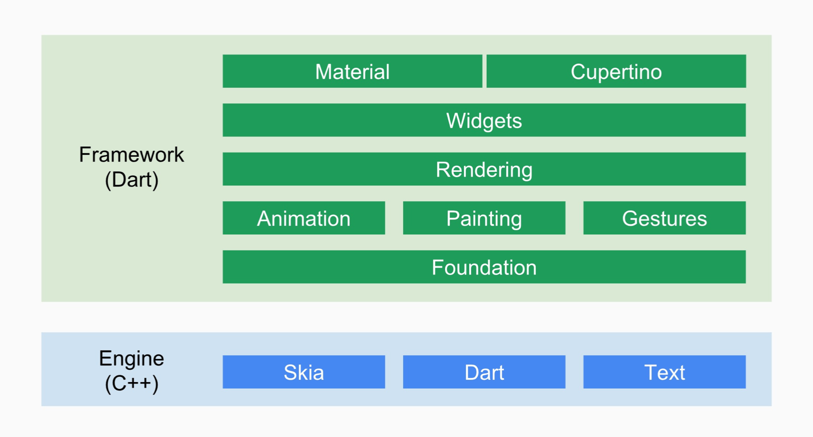

* # 1.简单的说说Flutter优缺点以及理念架构：
#### 答案：
### 优点

* 热重载（Hot Reload），利用Android Studio直接一个ctrl+s就可以保存并重载，模拟器立马就可以看见效果，相比原生冗长的编译过程强很多；
* 一切皆为Widget的理念，对于Flutter来说，手机应用里的所有东西都是Widget，通过可组合的空间集合、丰富的动画库以及分层课扩展的架构实现了富有感染力的灵活界面设计；
* 借助可移植的GPU加速的渲染引擎以及高性能本地代码运行时以达到跨平台设备的高质量用户体验。 简单来说就是：最终结果就是利用Flutter构建的应用在运行效率上会和原生应用差不多。

### 缺点

* 不支持热更新；
* 三方库很少，需要自己造轮子（不过现在越来越多了，社区也越来越强了）；
* dart语言编写，掌握该语言的开发者很少（不过有其他语言基础的掌握起来也特别容易）。

### 理念架构
Flutter 主要分为 Framework  和 Engine，我们基于Framework 开发App，运行在 Engine 上。Engine 是 Flutter 的独立虚拟机，由它适配和提供跨平台支持，目前猜测 Flutter 应用程序在 Android 上，是直接运行 Engine 上 所以在是不需要Dalvik虚拟机。（这是比kotlin更彻底，抛弃JVM的纠缠？  ）
  得益于 Engine 层，Flutter 甚至不使用移动平台的原生控件， 而是使用自己  Engine 来绘制 Widget （Flutter的显示单元），而 Dart 代码都是通过 AOT 编译为平台的原生代码，所以 Flutter 可以 直接与平台通信，不需要JS引擎的桥接。同时 Flutter 唯一要求系统提供的是 canvas，以实现UI的绘制。

* # 2.简单的解释下Flutter的FrameWork层和Engine层：
#### 答案：
### FrameWork层
Flutter的顶层是用drat编写的框架（SDK），它实现了一套基础库，包含Material（Android风格UI）和Cupertino（iOS风格）的UI界面，下面是通用的Widgets（组件），之后是一些动画、绘制、渲染、手势库等。这个纯 Dart实现的 SDK被封装为了一个叫作 dart:ui的 Dart库。我们在使用 Flutter写 App的时候，直接导入这个库即可使用组件等功能。

### Engine层
* Skia是Google的一个 2D的绘图引擎库，其前身是一个向量绘图软件，Chrome和 Android均采用 Skia作为绘图引擎。Skia提供了非常友好的 API，并且在图形转换、文字渲染、位图渲染方面都提供了友好、高效的表现。Skia是跨平台的，所以可以被嵌入到 Flutter的 iOS SDK中，而不用去研究 iOS闭源的 Core Graphics / Core Animation。Android自带了 Skia，所以 Flutter Android SDK要比 iOS SDK小很多。
* 第二是Dart 运行时环境
* 第三文本渲染布局引擎。

